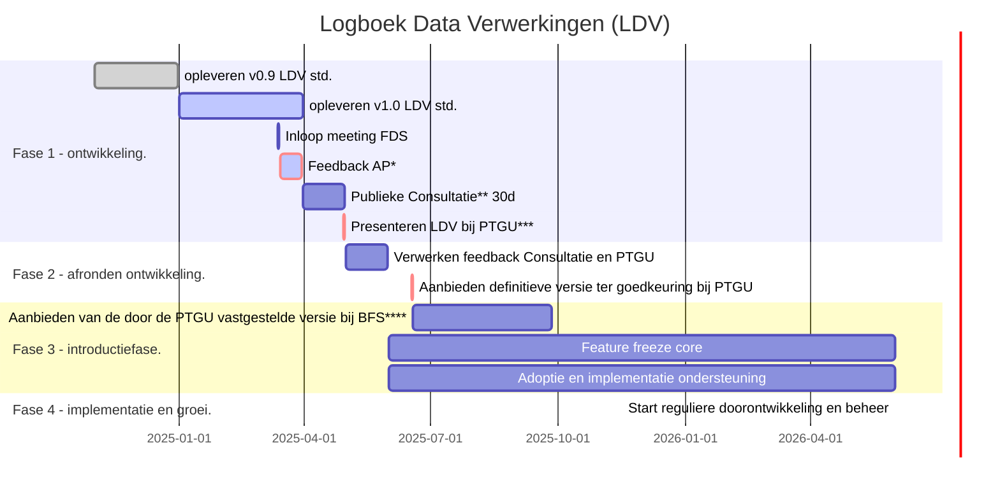

# Logboek Data Verwerkingen (LDV) Planning 2025

De Logboek Data Verwerkingen standaard bevind zich in een afrondende faseen we willen graag transparant en open zijn over de komende mijlpalen en ontwikkelingen. Vandaar dat we deze planning publiceren als onderdeel van de inleidende documentatie. Uiteraard is dit een momentopname van maart 2025 en nieuwe inzichten gaan leiden tot aanpassingen in de planning.

## Toelichting:

\* AP: [Autoriteit Persoonsgegevens](https://www.autoriteitpersoonsgegevens.nl/)

\** Publieke Consultatie : https://www.internetconsultatie.nl/

\*** PTGU: [Programmeringstafel Gegevensuitwisseling van het MIDO](https://pgdi.nl/)

\**** BFS :  [Buro Forum Standaardisatie](https://www.forumstandaardisatie.nl/open-standaarden/in-behandeling)

## Tot Slot

Deze planning is een concept en bevat verwachte werkzaamheden en data. er kunenn geen rechten worden ontleend aan deze planning en de verwachtingen zullen worden bijgesteld op basis van feedback en voortschrijdend inzicht.
