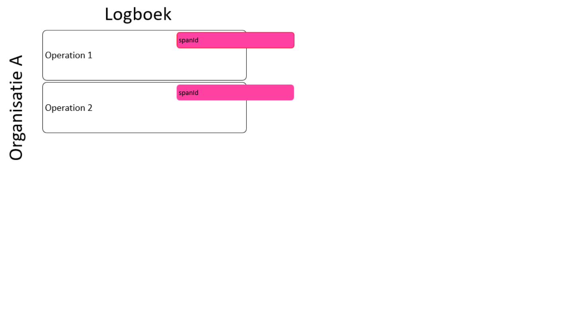
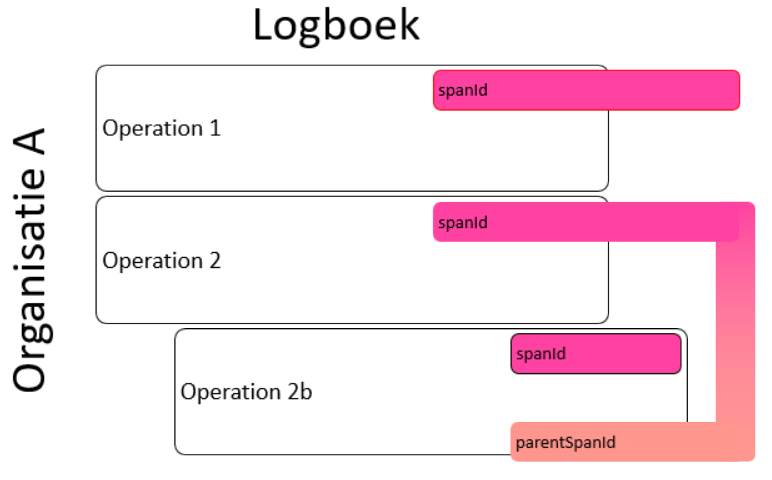
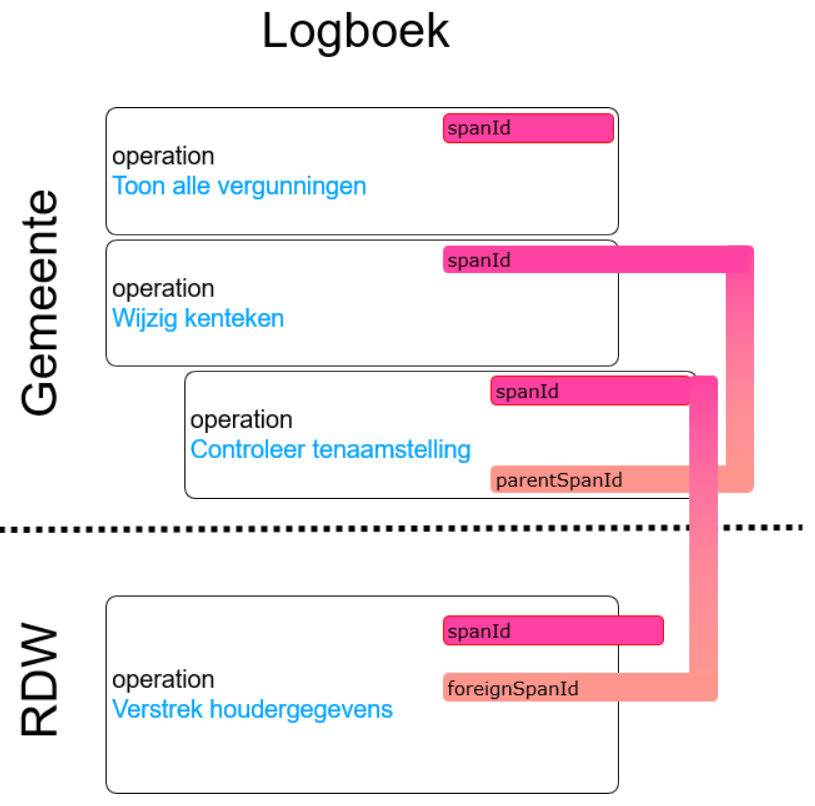

### De relatie tussen logboekelementen, waarom eigenlijk?
Logging van gegevensverwerkingen kunnen vaak en veelvuldig plaatsvinden. Het geheel kan groot en complex worden want sommige Logregels zijn aan elkaar gerelateerd. Deze relaties kunnen gelegd worden met Logregels met andere applicaties binnen dezelfde organisatie of met logregels van applicaties van andere organisaties. Maar ook zijn er relaties nodig met activiteiten in het Register van Verwerkingsactiviteiten.
Wat nu als alle Logregels zonder relaties worden opgeslagen? Bij een rapportage (bijvoorbeeld een verzoek tot inzage van een burger) moet nu handmatig worden uitgezocht welke gegevensverwerkingen bij elkaar horen en er moet, in het ernstigste geval, ook contact worden gezocht moet andere organisaties om te onderzoeken of daar ook de nodige gegevensverwerkingen zijn uitgevoerd. Als er bij elke Logregel de nodige relatiegegevens worden bijgevoegd, kan de rapportage snel en accuraat worden gegenereerd.

### Welke relatiegegevens moeten er dan worden opgeslagen per Logregel?
Om er zeker van te zijn dat de relatie tussen Logregels gelegd kan worden, moeten de volgende gegevens worden geregistreerd per Logregel:

•	**processingActivityId**: elke gegevensverwerking die een organisatie doet, moet bekend zijn in het Register van Verwerkingsactiviteiten. Het processingActivity legt de relatie tussen de gegevensverwerking door een applicatie, en de activiteit gedefinieerd in het Register.

•	**traceId**: alle logregels die voor een specifieke gegevensverwerking bij elkaar horen, krijgen een traceId. De traceId-waarde voor alle Logregels die bij elkaar horen is hetzelfde.

•	**operationId**: elke individuele Logregel (Operation) krijgt een eigen, unieke operationId (net zoals elk databaserecord dat ook krijgt).

In werkelijkheid worden alle relaties door de Applicatie in een fractie van een seconde (in parallel)  gelegd. Om het grote geheel beter te begrijpen, worden alle relaties hieronder stap voor stap uitgelegd.

### Het logboek en het Register van Verwerkingsactiviteiten 
Als er een Dataverwerking plaatsvindt, moet dit altijd een relatie hebben met het Register van Verwerkingsactiviteiten. In dit Register staat informatie over de gegevens die een organisatie verwerkt. Het Register is verplicht, een geautomatiseerde koppeling met het Logboek niet. Bij elke Dataverwerking wordt door het Logboek een relatie gelegd met het Register door middel van het processingActivityId. 
Als er meerdere dezelfde Dataverwerkingen (‘Operations’) zijn, krijgen deze dus allemaal dezelfde processingActivityId.

In het geval er een Dataverwerking plaatsvindt ter ondersteuning van een andere Dataverwerking (suboperation), dan kan deze ondersteunende Dataverwerking een eigen processingActivityId krijgen. Deze kan anders zijn dan het processingActivityId van de ‘hoofdprocessingActivity’.

De subOperation heeft nu een eigen processingActivityId gekregen, maar het is nog niet duidelijk aan welke hoofdprocessingActivityId deze gekoppeld is. Om dit op te lossen, wordt ook een ‘parentProcessingActivityId’ geregistreerd. Bij de subOperation wordt in dit geval naast de processingActivityId ook een parentProcessingActivityId geregistreerd. De waarde van deze parentProcessingActivityId is gelijk aan de waarde van het hoofdProcessingActivityId.

Bij een Dataverwerking kan het zijn dat gegevens moeten worden opgevraagd bij een andere organisatie. Deze organisatie heeft zelf ook een Register van Verwerkingsactiviteiten. In dit Register staat beschreven dat een specifieke organisatie specifieke gegevens mag opvragen als aparte operation. Bij het verstrekken van deze gegevens aan de aanvragende organisatie, wordt het processingActivityId van de gegevensverstrekkende organisatie geregistreerd. Er is dus GEEN rechtstreekse koppeling tussen het Register van de aanvragende en het Register van de verstrekkende organisatie.

### TraceId als grootste gemene deler
Operations kunnen bestaan uit meerdere (sub)Operations binnen de eigen organisatie maar ook over organisaties heen. Het geheel kan een grote en ingewikkelde constructie worden. Om toch het overzicht te kunnen behouden, is het noodzakelijk een ‘traceId’ te introduceren per (sub)Operation. Het traceId is als het ware de ‘lijm’ tussen alle  (sub)Operations. Als er nog geen traceId bekend is, wordt deze automatisch gegenereerd voor de eerste Operation.

Alle bij elkaar horende (sub)Operations, krijgen vervolgens dezelfde traceId-waarde.

In het geval er gegevens worden opgevraagd aan een andere organisatie, krijgt elke operation bij verstrekkende organisatie een traceId. Om de relatie te leggen tussen de vragende en de verstrekkende organisatie, wordt bij elke Operation van de verstrekkende organisatie een ‘foreignOperationTraceId’ geregistreerd. De waarde van de foreignOperationTraceId van de verstrekkende organisatie is gelijk aan de waarde van traceId van de vragende organisatie.

### Relatie tussen (sub)Operations
Elke (sub)Operation krijgt een eigen, unieke operationId. Hiermee zijn alle loggings altijd uniek traceerbeer. Ook subOperations krijgen een eigen, unieke OperationId. 

Als er ook subOperations plaatsvinden, moet er ook een ‘parentOperationId’ worden geregistreerd om de koppeling met de hoofdOperation te realiseren.

In het geval er gegevens nodig zijn van een andere organisatie, krijgt de Operation van de verstrekkende organisatie ook een eigen, unieke operationId. Daarnaast wordt bij deze Operation ook het operationId geregistreerd die het verzoek voor informatie geïnitieerd heeft (vanuit de vragende organisatie). Deze specifieke operationId wordt het ‘foreignOperationId’ genoemd en krijgt de waarde gelijk aan het operationId van de initiërende Operation van de vragende organisatie.

### Voorbeeld van een traceringsconstructie
Het nu volgende voorbeeld is volledig fictief en is puur bedoeld om een beeld te schetsen ten behoeve van een traceringsconstructie in een logboek.
### Situatieschets
Een persoon heeft een parkeervergunning in een gemeente. Er is een nieuwe auto aangeschaft, het kenteken moet worden aangepast ten behoeve van de vergunning. De persoon kan het kenteken online wijzigen in de ‘mijnGemeente’ applicatie. Om het voorbeeld eenvoudig te houden, worden foutsituaties buiten beschouwing gelaten.
### Procesgang
  1.	Persoon logt in gemeenteapplicatie.
  2.	Gemeente toont huidige parkeervergunning.
  3.	Persoon wijzigt kenteken in de gemeenteapplicatie.
  4.	Gemeenteapplicatie vraagt het RDW om gegevens op basis van de tenaamstelling.
  5.	RDW geeft de gevraagde gegevens terug aan de gemeenteapplicatie.
  6.	Gemeenteapplicatie accepteert de wijziging van de persoon.

De traceringsgegevens worden als volgt vastgelegd:

**processingActivityId**
In de gemeenteapplicatie worden de volgende Operations uitgevoerd die een relatie hebben met het Register van Verwerkingsactiviteiten van de gemeente:
  •	**Toon alle vergunningen**: na het inloggen, worden de parkeervergunningen van de persoon getoond. Deze Operation is gerelateerd aan de processingActivity     **Parkeervergunningadministratie voeren**.
•	**Wijzig kenteken**: het wijzigen van het kenteken valt ook onder de processingActivity **Parkeervergunningadministratie** voeren. Hierdoor is het processingActivityId hetzelfde als die van de Operation **Toon alle vergunningen**.
•	**Controleer tenaamstelling:** deze Operation zorgt voor de aanvraag van gegevens richting het RDW en controle van de terugontvangen gegevens. Deze Operation is een subOperation van **Wijzig kenteken** en krijgt een processingActivity wat hoort bij de processingActivity in het Register genaamd **Tenaamstelling controleren**. De processingActivity is op zijn beurt weer een subprocessingActivity van **Parkeeradministratie voeren**. Om deze relatie te leggen, moet ook een parentProcessingActivityId worden geregistreerd. De waarde hiervan is gelijk aan de waarde van het processingActivityId van **Parkeervergunningadministratie voeren**.

In de RDW-applicatie wordt het verstrekken van gegevens aan de gemeenteapplicatie ook geregistreerd. De Operation **Verstrek houdergegevens** is gerelateerd aan de processingActivity **Kentekenhoudergegevens verstrekken**. Merk op dat er hier dus GEEN directe relatie is tussen het Register van Verwerkingsactiviteiten van de gemeente en die van het RDW.

### traceId
•	De gemeenteOperations **Toon alle vergunningen, Wijzig kenteken en Controleer tenaamstelling** behoren tot dezelfde handeling (met als eindresultaat het wijzigingen van het kenteken op de vergunning). Deze Operations krijgen allemaal dezelfde traceId. 
•	De RDW-Operation **Verstrek houdergegevens** krijgt een eigen traceId. 
•	Om het geheel te koppelen over de organisaties heen, wordt bij het RDW ook een foreignOperationTraceId opgeslagen, de waarde hier van is gelijk aan de waarde van de traceId van de Operation **Controleer tenaamstelling**.

### OperationId
In de gemeente-applicatie krijgt elke (sub)Operation een eigen, unieke OperationId. 
•	De (sub)Operation **Controleer tenaamstelling** krijgt daarnaast ook nog een parentOperationId met de waarde van OperationId van de **Operation Wijzig** kenteken om een relatie te leggen. 
•	Ook de RDW-Operation **Verstrek houdergegevens** krijgt een eigen unieke OperationId. 
•	Om de relatie over de organisaties heen te leggen, wordt er bij de RDW-Operation **Verstrek houdergegevens** ook een foreignOperationId moeten worden vastgelegd. De waarde van deze foreignOperationId is gelijk aan de waarde van de OperationId van de gemeente-Operation **Controleer tenaamstelling**.

### Totaalbeeld
Als alle relaties gelegd zijn, ziet de traceringsconstructie er als volgt uit:

Meer gedetailleerde voorbeelden staan beschreven in de [inleiding](https://github.com/Logius-standaarden/logboek-dataverwerkingen_Inleiding/blob/main/ch05_voorbeelden.md) van de standaard logboek dataverwerkingen.
